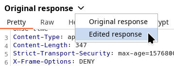

# HttpHandlerSample

This is a **template** extension for [Burp Suite](https://portswigger.net/burp). It provides an easy starting point for programmatically handling HTTP requests and responses from any Burp tool (Proxy, Repeater, Intruder, etc.). Use cases include:

* Create complex match-and-replace rules. 
* Perform a MiTM during handshakes over the HTTP layer, changing exchanged key pairs.
* Trigger actions (command, request, etc.) when a specific request or response is detected.
* Persist filtered information received from a web application.

## Implementing the extension

To complete this extension, implement the [RequestPatcher](app/src/main/java/handlersample/RequestPatcher.java) class with the following methods:

```java
public class RequestPatcher {
    public static boolean shouldPatchRequest(HttpRequest request, ToolType toolType);
    public static HttpRequest patchRequest(HttpRequest request, boolean[] refModifed);
    public static boolean shouldPatchResponse(HttpResponse response, HttpRequest request, ToolType toolType);
    public static HttpResponse patchResponse(HttpResponse response, HttpRequest request, boolean[] refModifed);
}
```

Then compile the extension using:

```bash
./gradlew build
```

You can control the Montoya API version via [build.gradle.kts](app/build.gradle.kts). To support the [most recent API versions](https://github.com/PortSwigger/burp-extensions-montoya-api), it is **recommended** to use an **up-to-date** version of Burp Suite as well.

Finally, load the JAR file (./app/build/libs/handlersample.jar) into Burp Suite via Extensions > Installed > Add.

Changes made to requests in the HTTP history (ToolType.PROXY) can be viewed by clicking the dropdown arrow:

